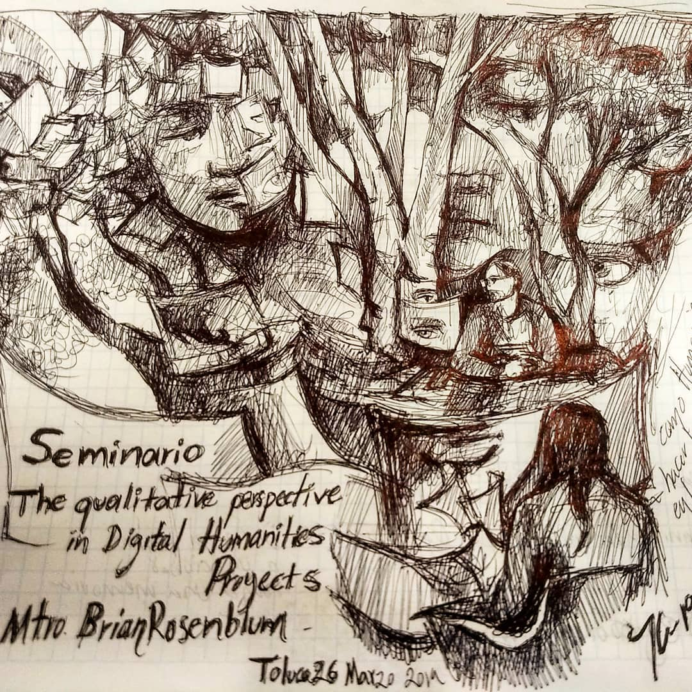

I am a Digital Scholarship Librarian at the [University of Kansas Libraries](http://lib.ku.edu) and Founding Co-Director of KU's [Institute for Digital Research in the Humanities](http://idrh.ku.edu). I work with faculty, students, librarians and technologists on digital scholarship-related projects and initiatives that support teaching, learning, and research. My research interests include public digital humanities, and globally sustainable and equitable modes of scholarly communication.

*Drawing by Julio César Guzmán Mejía*  
*(Click for larger size)*

